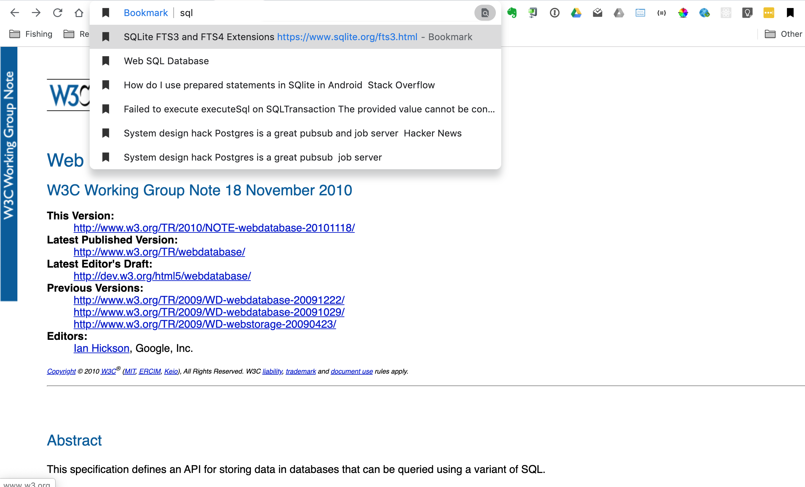

# Chrome Bookmark Extension with Full Text Search of Bookmarked Pages

A bookmark extension that saves the content of the page as well as the link. Find bookmarked pages by doing a full text search of page content in the Chrome omnibox: just type `bm+tab` in the omnibox and start searching. Bookmark pages by clicking the extension icon or use the keyboard shortcut for the extension: `shift+alt+b`.



# Building

```Shell
yarn build
```

Preps the extension for deployment. Output files are in the `./dist` folder and should be loaded into chrome as an unpacked extension in developer mode.
